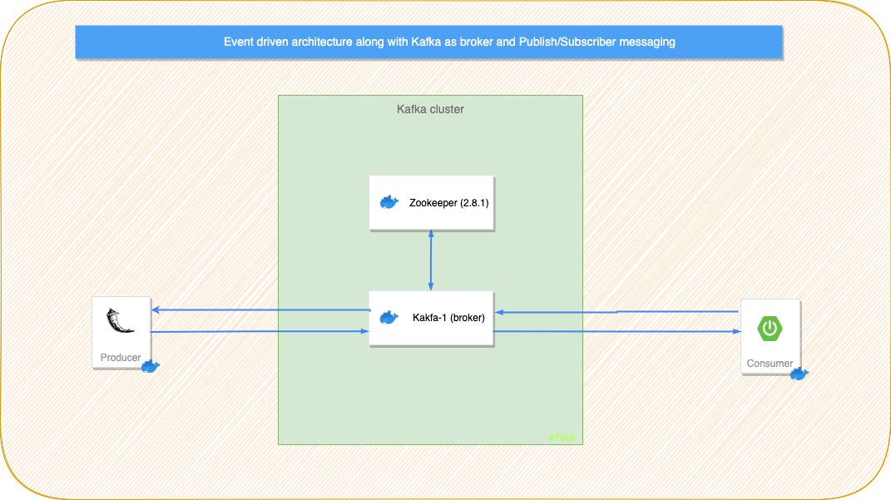
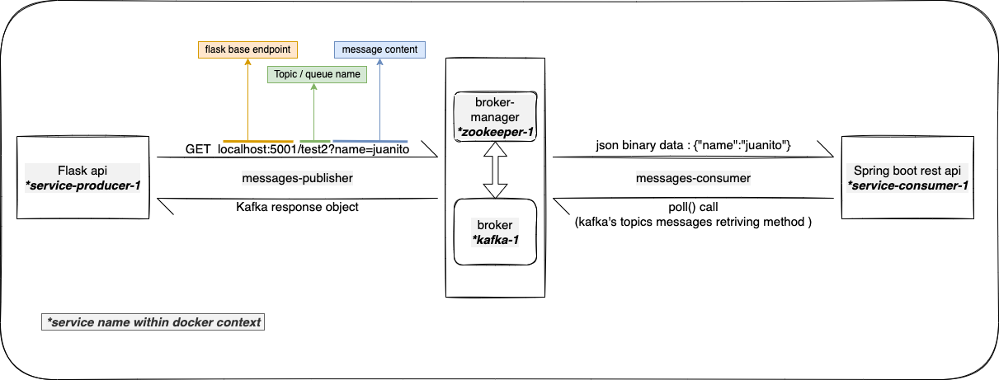

# Kafka cluster in docker :whale:

Building a custom image for kafka to set up containers for a zookeeper and some brokers to it.

### Schemas
**Simple Application Architecture**

**Custom use case diagram**
